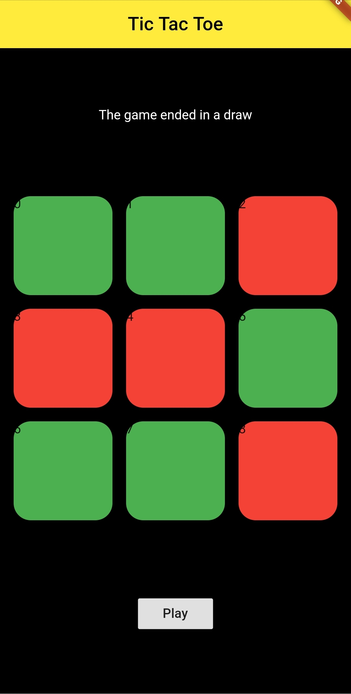

# Teme pentru cursul de Flutter oferit de Google - Atelierul Digital.
### [Imagini cu toate temele](https://github.com/smitoi/teme_flutter/tree/main/img)
### Lista temelor:

| Temă | Denumire | Imagini |
| :-: | :--: | :-: |
| 1 | Currency Converter   |  |
| 2.1 | Guess My Number |  |
| 2.2 | Number Shapes |  |
| 3.1 | Basic Phrases |  |
| 3.2 | Tic Tac Toe |  |
| 4 | Movie App | Vezi mai jos |
| 5 | Movie App + Redux |     |
| 6 | Photo App |   |

